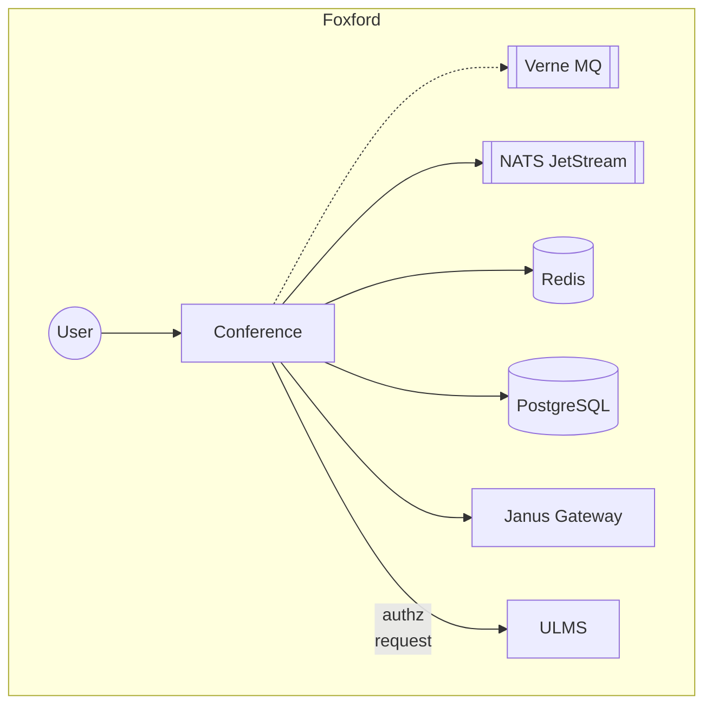

# Conference

## Карточка сервиса

<table data-header-hidden data-full-width="true"><thead><tr><th width="304"></th><th></th></tr></thead><tbody><tr><td>Название сервиса</td><td>conference</td></tr><tr><td>Система</td><td><a data-mention href="../sistemy/mediaservisy.md">mediaservisy.md</a></td></tr><tr><td>Ответственная команда</td><td></td></tr><tr><td>Репозиторий</td><td><a href="https://github.com/foxford/ulms-backend/tree/main/conference">https://github.com/foxford/ulms-backend/tree/main/conference</a></td></tr><tr><td>Язык программирования</td><td>Rust</td></tr><tr><td>Статус</td><td> <mark style="background-color:green;">Production</mark> </td></tr></tbody></table>

## Описание

Предоставляет публичное API видео стриминга для конечных пользователей и управляет пулом серверов видео стриминга Janus.

_Примечание: будет полностью поглощен сервисом_ [_ULMS_](ulms-ex.-dispatcher.md)_. Сервис ULMS обеспечивает создание комнат видео стриминга в Conference и проксирование запросов авторизации из Conference на портал Фоксфорд._

...

## Схема работы

