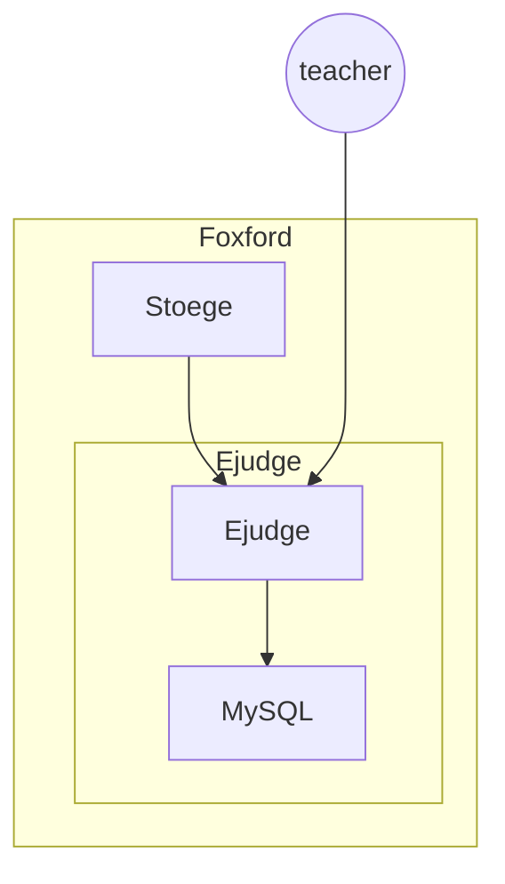

# Ejudge

## Карточка сервиса

<table data-header-hidden data-full-width="true"><thead><tr><th width="304"></th><th></th></tr></thead><tbody><tr><td>Название сервиса</td><td>ejudge</td></tr><tr><td>Система</td><td><a data-mention href="../sistemy/portal.md">portal.md</a></td></tr><tr><td>Ответственная команда</td><td>–</td></tr><tr><td>Репозиторий</td><td><a href="https://ejudge.ru/">https://ejudge.ru/</a></td></tr><tr><td>Язык программирования</td><td>C</td></tr><tr><td>Статус</td><td> <mark style="background-color:red;">Legacy</mark> </td></tr></tbody></table>

## Описание

Ejudge – это система автоматической проверки заданий по программированию. Поддерживает различные языки программирования:

* C
* C++
* Free Pascal
* Java
* PascalABC.NET
* Python 3
* Ruby
* КуМир


Система была разработана в \~2016 году и с того момента больше не получала обновлений. Команда разработки **не поддерживает этот сервис**.

Команда эксплуатации обеспечивает нормальную работу сервиса, ничего более мы сделать на данный момент не можем.

Известные проблемы:

* сервис использует крайне старую ОС для своей работы Fedora 20 (Heisenbug), в которой есть уязвимости
* сервис запущен в единственном экземпляре на одной VM
* для СУБД MySQL, которая используется сервисом Ejudge, не делаются резервные копии


Целевая система для миграции с Ejudge – это [Judge0](https://judge0.com/), но Ejudge до сих пор используется для проверки домашних заданий по программированию.

Админка сервиса расположена здесь: [http://ejudge.foxford.ru/cgi-bin/serve-control](http://ejudge.foxford.ru/cgi-bin/serve-control)

## Схема работы

