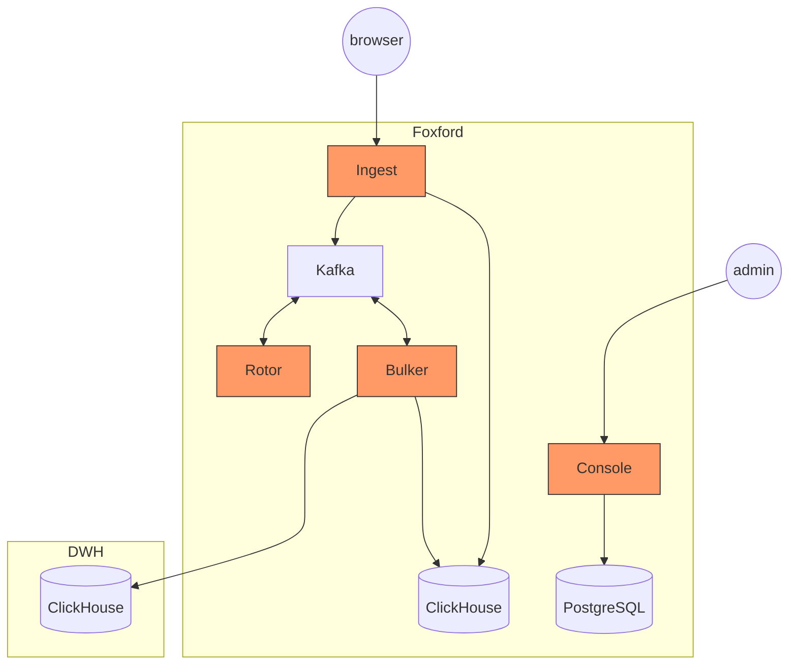

# Jitsu

## Карточка сервиса

<table data-header-hidden data-full-width="true"><thead><tr><th width="304"></th><th></th></tr></thead><tbody><tr><td>Название сервиса</td><td>jitsu</td></tr><tr><td>Система</td><td><a data-mention href="../sistemy/analitika.md">analitika.md</a></td></tr><tr><td>Ответственная команда</td><td>DevOps</td></tr><tr><td>Репозиторий</td><td>
Исходный код:

<a href="https://github.com/jitsucom/jitsu/">https://github.com/jitsucom/jitsu/</a>

<a href="https://github.com/jitsucom/bulker/">https://github.com/jitsucom/bulker/</a>

Helm chart:

<a href="https://github.com/foxford/jitsu">https://github.com/foxford/jitsu</a>
</td></tr><tr><td>Язык программирования</td><td>Go, TypeScript</td></tr><tr><td>Статус</td><td> <mark style="background-color:green;">Production</mark> </td></tr></tbody></table>

## Описание

Open-source решение, которое пришло на замену TopMind в качестве приемника для событий, которые потом сохраняются в ClickHouse и могут быть использованы в аналитике.

Основная часть событий отправляется из браузера с помощью JavaScript трекера, который разрабатывается внутри Фоксфорда.

Основные компоненты Jitsu:

1. **Console** – сервис, который позволяет управлять конфигурацией Jitsu. Например, добавлять новые источники, редактировать список подключений, UDF функций и т. п.
2. **Ingest** – это API для приёма событий. Принимает HTTP запрос и складывает полученное сообщение в кластер Kafka.
3. **Rotor** – позволяет обрабатывать полученные сообщения с помощью UDF и, например, обогащать события дополнительными данными или изменять их.
4. **Bulker** – отвечает за загрузку данных в целевое хранилище. В нашем случае, загружает данные батчами в ClickHouse.

Сопутствующие компоненты:

1. **Kafka** – основной транспорт, который используется для общения между сервисами.
2. **PostgreSQL** – хранит текущую конфигурацию Jitsu.
3. **ClickHouse** – необходим для хранения логов событий и батч-загрузок.


Официальная документация: [https://docs.jitsu.com/self-hosting/production-deployment](https://docs.jitsu.com/self-hosting/production-deployment)


## Схема работы

