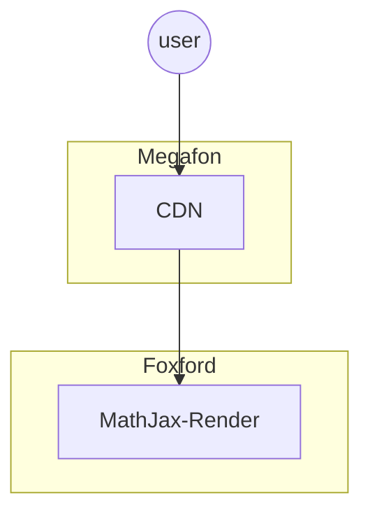

# MathJax Server-Side Render

## Карточка сервиса

<table data-header-hidden data-full-width="true"><thead><tr><th width="304"></th><th></th></tr></thead><tbody><tr><td>Название сервиса</td><td>mathjax-render</td></tr><tr><td>Система</td><td><a data-mention href="../sistemy/portal.md">portal.md</a></td></tr><tr><td>Ответственная команда</td><td></td></tr><tr><td>Репозиторий</td><td><a href="https://github.com/foxford/mathjax-render-node">https://github.com/foxford/mathjax-render-node</a></td></tr><tr><td>Язык программирования</td><td>JavaScript</td></tr><tr><td>Статус</td><td> <mark style="background-color:green;">Production</mark> </td></tr></tbody></table>

## Описание

Отрисовка формул на стороне браузера работает крайне плохо – этот процесс может занимать **десятки** секунд, если страница содержит достаточно много формул. В следствие этого генерация формул происходит на стороне сервера – за это и отвечает сервис MathJax Render.

На вход сервис принимает описание формулы в формате TeX в виде строки, которая закодирована с помощью Base64. На выходе сервис отдаёт изображение формулы в формате SVG.

Пример для формулы `y = x ^ 2` : [https://math.ngcdn.ru/v3/eSA9IHggXiAy.svg](https://math.ngcdn.ru/v3/eSA9IHggXiAy.svg)

## Схема работы

