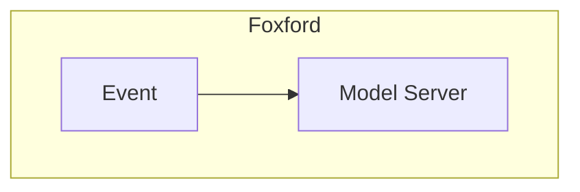

# Model  Server

## Карточка сервиса

<table data-header-hidden data-full-width="true"><thead><tr><th width="304"></th><th></th></tr></thead><tbody><tr><td>Название сервиса</td><td>model-server</td></tr><tr><td>Система</td><td><a data-mention href="../sistemy/mediaservisy.md">mediaservisy.md</a></td></tr><tr><td>Ответственная команда</td><td></td></tr><tr><td>Репозиторий</td><td><a href="https://github.com/foxford/ulms-backend/tree/main/model-server">https://github.com/foxford/ulms-backend/tree/main/model-server</a></td></tr><tr><td>Язык программирования</td><td>Rust</td></tr><tr><td>Статус</td><td> <mark style="background-color:orange;">Development</mark> </td></tr></tbody></table>

## Описание

Сервер для хостинга нейросетевых моделей. Используется  для классификации сообщений чата на токсичность.

## Схема работы

