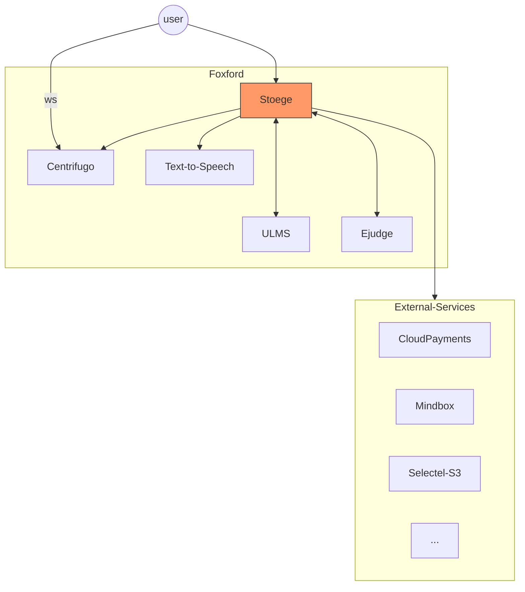
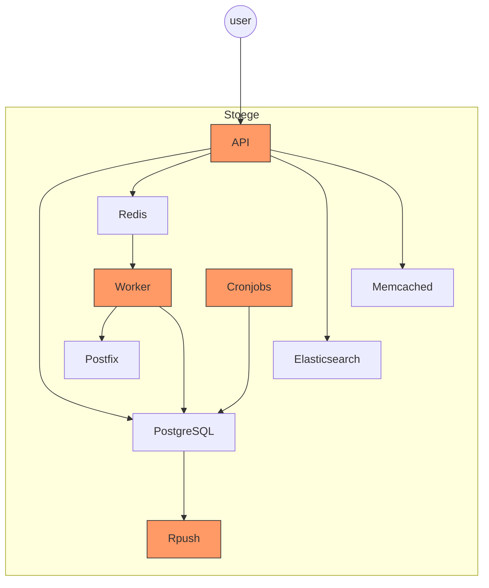

# Stoege

## Карточка сервиса

<table data-header-hidden data-full-width="true"><thead><tr><th width="304"></th><th></th></tr></thead><tbody><tr><td>Название сервиса</td><td>stoege</td></tr><tr><td>Система</td><td><a data-mention href="../sistemy/portal.md">portal.md</a></td></tr><tr><td>Ответственная команда</td><td></td></tr><tr><td>Репозиторий</td><td><a href="https://github.com/foxford/stoege">https://github.com/foxford/stoege</a></td></tr><tr><td>Язык программирования</td><td>Ruby, JavaScript</td></tr><tr><td>Статус</td><td> <mark style="background-color:green;">Production</mark> </td></tr></tbody></table>

## Описание

Основное приложение проекта Фоксфорд – это сайт [foxford.ru](https://foxford.ru/). В приложении реализована вся основная бизнес-логика продукта – менеджмент пользователей, каталоги, LMS, учебник, биллинг, админка, интеграции с внешними системами и т. д.


[Документация](https://app.gitbook.com/o/-LlaQkilti\_ARcKW5Lzd/s/-LlaSGK2z2toCfPK4bpr/)


Кодовая база представляет из себя монорепозиторий, в котором находятся два приложения – **бекенд-приложение** на Ruby и **клиентское приложение** на JavaScript.

Бекенд-приложение имеет монолитную архитектуру и представляет из себя классическое Ruby on Rails приложение, которое состоит из 4-х основных сервисов:

1. **API** – бекенд, который обрабатывает HTTP запросы
2. **Worker** – обработчик для фоновых задач (используется [Sidekiq](https://github.com/sidekiq/sidekiq))
3. **Rpush** – обработчик для отправки Push нотификаций на мобильные устройства
4. **Cronjobs** – задачи, которые запускаются по расписанию

Клиентское приложение собирается с помощью [Webpack](https://webpack.js.org/) в набор статических файлов, которые раздаются через [CDN](https://www.cloudflare.com/). SSR на данный момент нет.

Над развитием приложения одновременно работает 7 продуктовых команд:

* GP Growth
* GP 1:1
* Маркетинг / CRM
* Домашняя школа
* Дошколка и начальная школа (ДиН)
* Мотивация
* Экосистема

За каждой командой закреплена определенная зона ответственности, за которую она отвечает и занимается её развитием.

## Схема работы

Диаграмма связей с другими сервисами

Упрощенная схема работы приложения

