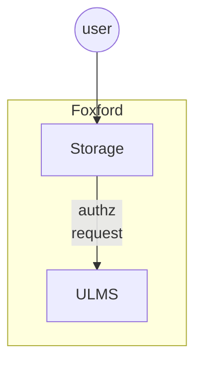

# Storage

## Карточка сервиса

<table data-header-hidden data-full-width="true"><thead><tr><th width="304"></th><th></th></tr></thead><tbody><tr><td>Название сервиса</td><td>storage</td></tr><tr><td>Система</td><td><a data-mention href="../sistemy/mediaservisy.md">mediaservisy.md</a></td></tr><tr><td>Ответственная команда</td><td></td></tr><tr><td>Репозиторий</td><td><a href="https://github.com/foxford/ulms-backend/tree/main/storage">https://github.com/foxford/ulms-backend/tree/main/storage</a></td></tr><tr><td>Язык программирования</td><td>Rust</td></tr><tr><td>Статус</td><td> <mark style="background-color:green;">Production</mark> </td></tr></tbody></table>

## Описание

Обеспечивает авторизацию доступа к медиаконтенту, который хранится во внешнем облачном хранилище.

Сервис **не выполняет** проксирование контента, вместо этого он проверяет авторизацию доступа, генерирует подпись для запроса и отвечает с HTTP статусом 307 Temporary Redirect с ссылкой на облачное хранилище. Для подписи запросов используется механизм pre-signed URL из S3 API ([ссылка на документацию](https://yandex.cloud/ru/docs/storage/concepts/pre-signed-urls) в Яндекс.Облако).

_Примечание: будет полностью поглощен сервисом_ [_ULMS_](ulms-ex.-dispatcher.md)_. Сервис ULMS обеспечивает проксирование запросов авторизации из Storage на портал Фоксфорд._

## Схема работы

