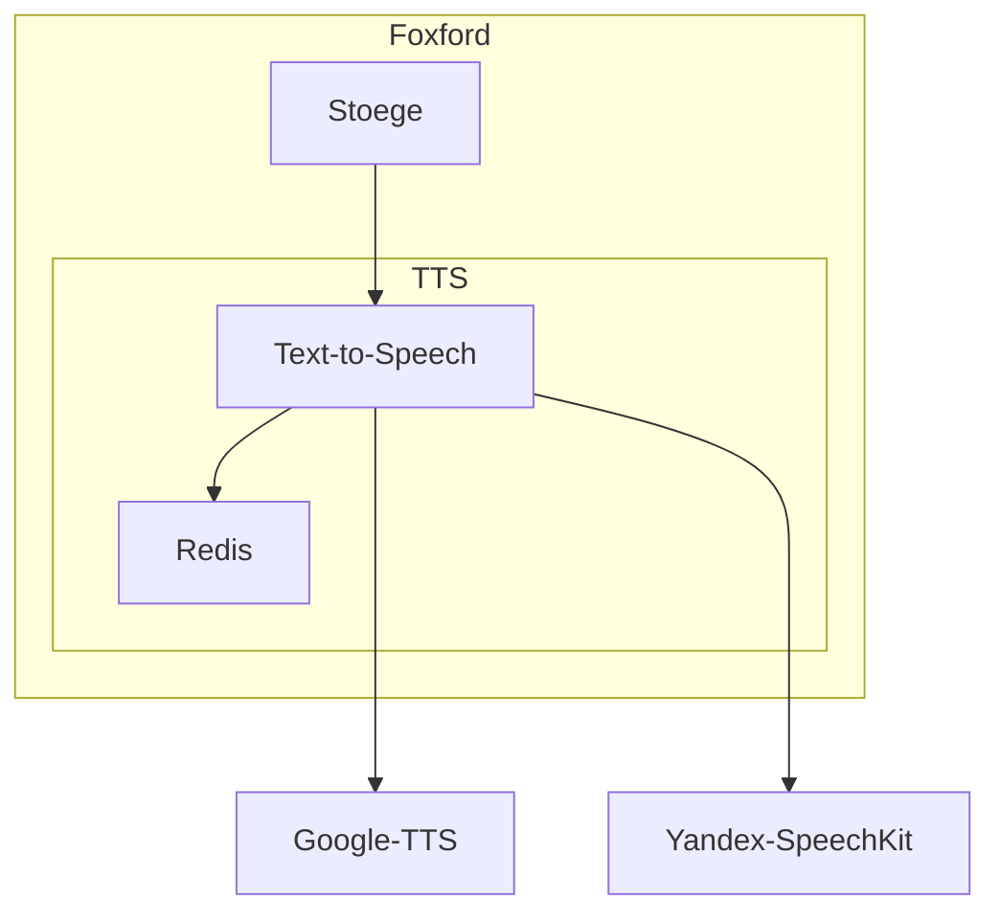

# Text-to-Speech

## Карточка сервиса

<table data-header-hidden data-full-width="true"><thead><tr><th width="304"></th><th></th></tr></thead><tbody><tr><td>Название сервиса</td><td>text-to-speech</td></tr><tr><td>Система</td><td><a data-mention href="../sistemy/portal.md">portal.md</a></td></tr><tr><td>Ответственная команда</td><td></td></tr><tr><td>Репозиторий</td><td><a href="https://github.com/foxford/text-to-speech">https://github.com/foxford/text-to-speech</a></td></tr><tr><td>Язык программирования</td><td>Ruby</td></tr><tr><td>Статус</td><td> <mark style="background-color:green;">Production</mark> </td></tr></tbody></table>

## Описание

Внутренний сервис, который обеспечивает взаимодействие с внешними системами синтеза речи на различных языках – [Google TTS](https://cloud.google.com/text-to-speech) и [Yandex SpeechKit](https://yandex.cloud/ru/docs/speechkit/).

На вход подаётся строка для озвучки, на выходе сервис отдает файл в формате Opus или AAC. Конвертация аудио происходит с помощью FFmpeg.

## Схема работы

