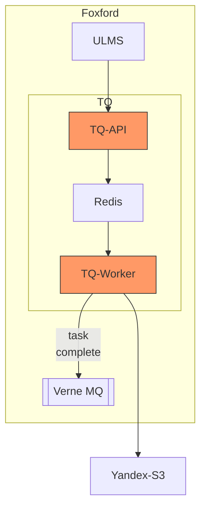

# TQ

## Карточка сервиса

<table data-header-hidden data-full-width="true"><thead><tr><th width="304"></th><th></th></tr></thead><tbody><tr><td>Название сервиса</td><td>tq</td></tr><tr><td>Система</td><td><a data-mention href="../sistemy/mediaservisy.md">mediaservisy.md</a></td></tr><tr><td>Ответственная команда</td><td></td></tr><tr><td>Репозиторий</td><td><a href="https://github.com/foxford/tq">https://github.com/foxford/tq</a></td></tr><tr><td>Язык программирования</td><td>Ruby, Bash</td></tr><tr><td>Статус</td><td> <mark style="background-color:green;">Production</mark> </td></tr></tbody></table>

## Описание

Название – это акроним от **T**ask **Q**ueue или **T**ranscoding **Q**ueue. Сервис состоит из двух компонентов:

1. API, которое принимает HTTP запрос и добавляет задачи на транскодинг в очередь.
2. Воркеры, на которых выполняется сам транскодинг.

Транскодинг включает в себя операции транскодирования медиафайлов с помощью FFmpeg, их дальнейшую "нарезку" в формат HLS и загрузку во внешнее облачное хранилище.

_Примечание: будет полностью поглощен сервисом_ [_ULMS_](ulms-ex.-dispatcher.md)_. Сервис ULMS ставит задачи на транскодинг и обеспечивает проксирование запросов авторизации из Tq на портал Фоксфорд._

## Схема работы

